# How To

## Create a content type

The first thing you are going to do is to create a content type called _Case_. Each case will be represented by a Drupal node.

Click on Structure from the main menu. On the screen that appears, click on Content types.

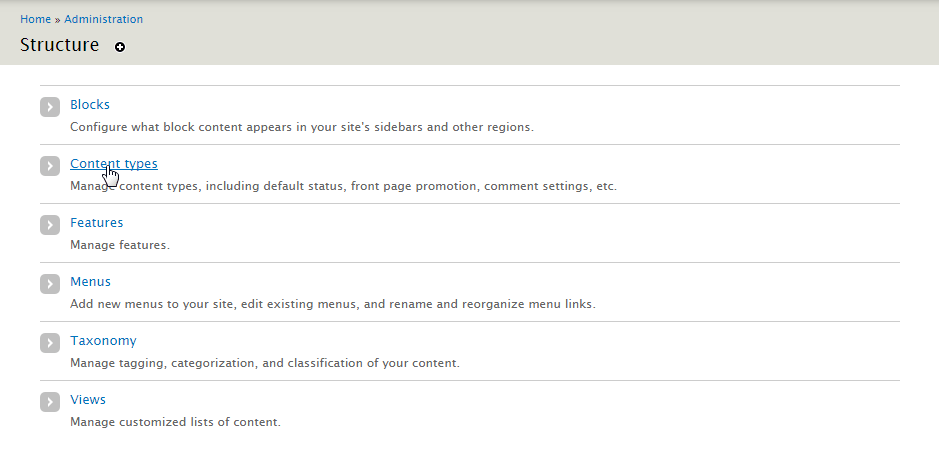

You will now see a list of current content types. Click on Add content type.

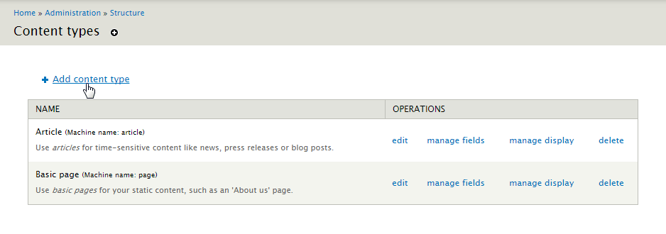

You will then be presented with a form to complete. You will want to call the content type Case so that when a user wants to add a new case to the directory, they will simply go to Add Content and Case. So type Case into the name field.

You will notice that Drupal automatically fills in the machine name to match the human readable name. This machine name is Drupal's internal way of identifying the content type.

Next, you need to add a description. This will appear on the Add Content screen, so it should be instructive and explanatory. Something like, "Add a Case to report on an ongoing or historic investigation." As we are using this to list law enforcement cases, you may also want to change the title field label to "Case number" or "Case ID". At GBI, case numbers are used as the node title - that way each title is unique.

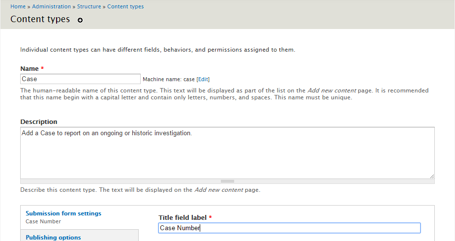

Since you probably don't want your Cases to be automatically promoted to the front page, choose the Publishing Options vertical tab and uncheck "Promoted to front page". Select the Display settings vertical tab and uncheck "Display author and date information." Finally, select the Comment settings and changes the "Default comment setting for new content" to "Hidden".

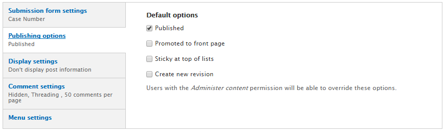

Now click the "Save and Add Fields" button to add some fields to your new content type.

### Add Fields to the Case content type

No doubt you'll want to sort your cases by type. Add a new field called Case Type.
- **Label:** Case Type
- **Field Type:** List (text)
- **Widget:** Select list

Then save.

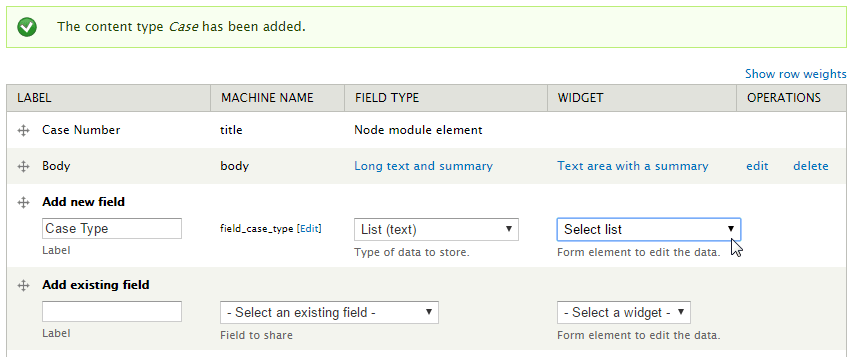

On the next screen, you'll want to list your case types as `safe-key|Human name`. For GBI, our case types are listed on this screen like this:

    unsolved-homicide|Unsolved Homicide
    unidentified-remains|Unidentified Remains
    missing-persons|Missing Persons
    robberies|Robberies

Once you've added a few of your own case types, save the field settings.

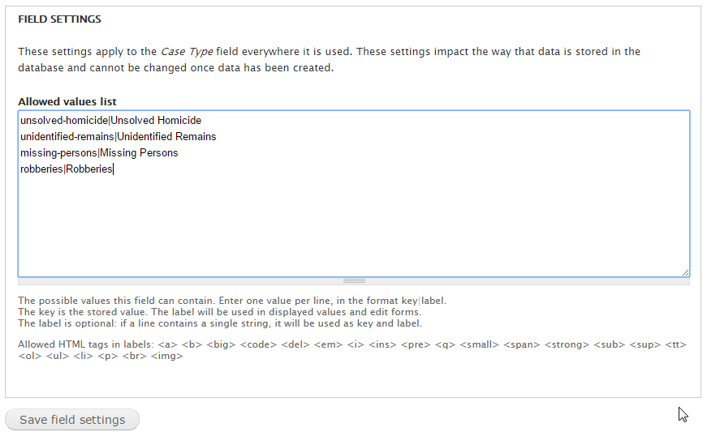

On the next screen, make sure to check the box making your Case type required.

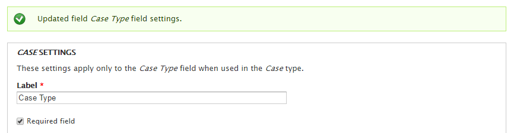

#### Add Field Groups for Organizing Your Fields (optional)

Next, you'll want to define some fields for adding details about each individual case. For GBI, we organize most of the details into two Vertical Tabs: **Case Info** and **Person Description**. Organizing groups into Vertical Tabs (or other style of group) is helpful for your content managers when they are entering information about your cases. Grouping fields into Vertical Tabs is made possible by the Field_group module.

On the Manage Fields page, add a new Case Info group.

- **Label:** Case Info
- **Group machine name:** case_info
- **Widget:** Vertical Tab

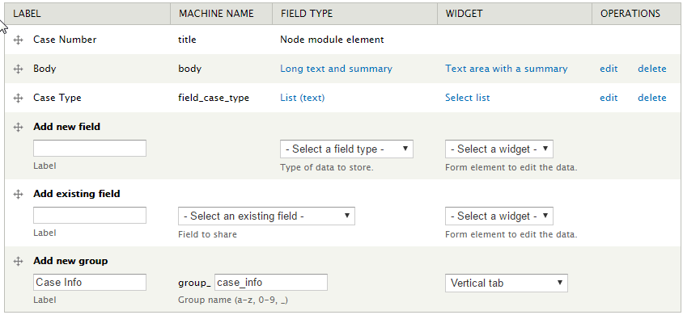

Then scroll to the bottom of the page and Save.

Create a second group: Person Description

- **Label:** Person description
- **Group machine name:** case_person_description
- **Widget:** Vertical Tab

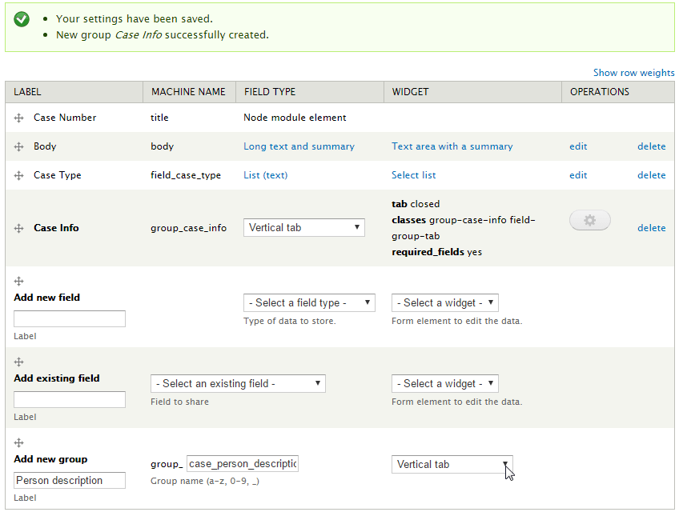

Then scroll to the bottom of the page and Save.

Now that you have your groups set up, you can start adding and arranging many new fields. The first task is to rename and move the Body field. On the Manage Fields screen for the Case content type, choose the "edit" link for the Body field.

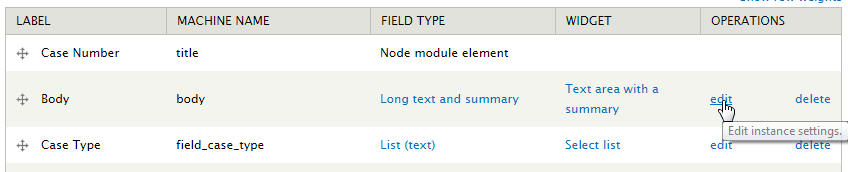

On the next screen, change the label to Narrative. Then save the settings.

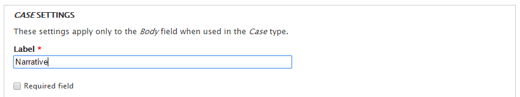

Back on the Manage Fields screen, drag the Narrative field into the Case Info field group, then Save.

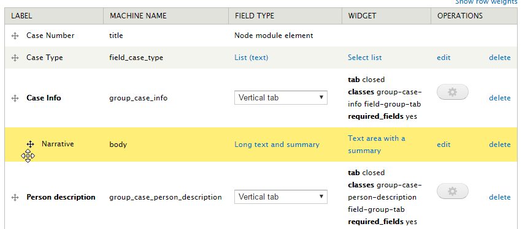

#### Add a Date Field

No matter what other information you will be collecting as part of your Case content type, there will definitely be an associated Date. So let’s add a Date field.

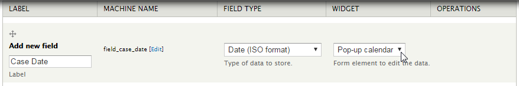

- **Label:** Case Date
- **Field type:** Date (ISO format)
- **Widget:** Pop-up Calendar

Save.

In the field settings, set “Date attributes to collect” to Year, Month, and Day. Make sure Hour, Minute, and Second are unchecked. Then Save field settings.

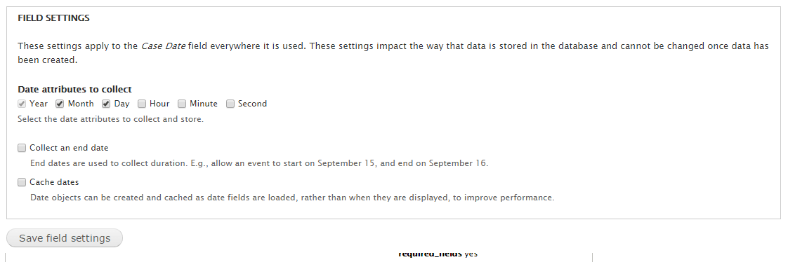

On the next page, set the Date Entry values to whatever is most appropriate for your organization and save.

Back on the Manage Fields page, drag the Case Date field into the Case Info field group. Make sure to save your new order before moving on.

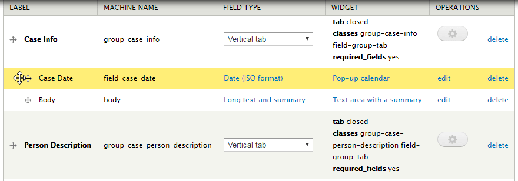

#### Even More Fields

For GBI, these are the fields we have set up for the case content type. This is just one instance, you can adjust the available fields for your own organization, including the types of fields.

Name                    | Field Type            | Widget
----------------------- | --------------------- | ------------------------
Case Number (title)     | Node module element   |
Case Type               | List (text)           | Select list
**Case Info**           | **field group** - Vertical Tab |
Case Date               | Date (ISO format)     | Text field
Location                | Text                  | Text field
Contact Info            | Text                  | Text field
Crimes                  | Text                  | Text field
Narrative (body)        | Long text and summary | Text area with a summary
**Person description**  | **field group** - Vertical Tab |
Thumbnail Image         | Image                 | Image
Person Name             | Text                  | Text field
Race                    | Text                  | Text field
Weight                  | Text                  | Text field
Height                  | Text                  | Text field
Sex                     | List (text)           | Select list
Age                     | Integer               | Text field
Hair Color              | Text                  | Text field
Eye Color               | Text                  | Text field
Birth Range             | Text                  | Text field

[See this drupal.org documentation for more help on adding and managing fields on a content type.](https://www.drupal.org/docs/7/nodes-content-types-and-fields/add-a-field-to-a-content-type)

## Add Data

You have your new Case content type all set up and ready to organize your cases. So start by adding some case data to your new content type. Go to Content, Add Content and then Case. You will be presented with a interface for adding a new case.

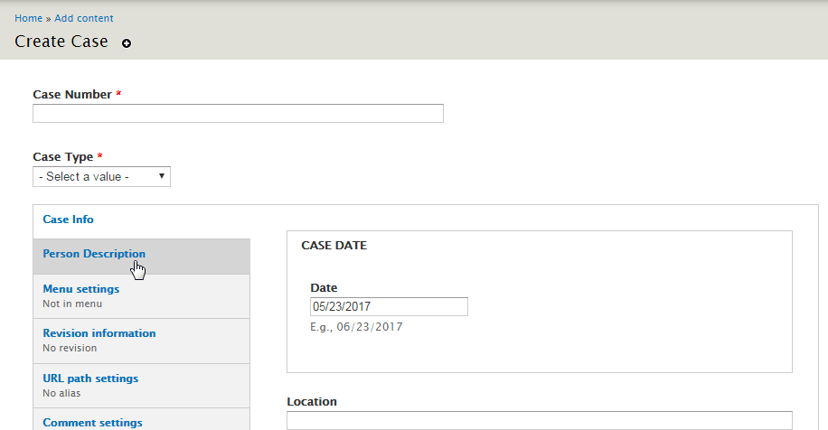

Add in some case information for each field. This lets you see your new content type in action. This will come in handy when you are creating your View.

Next, [create a View.](02_create_view.md)
