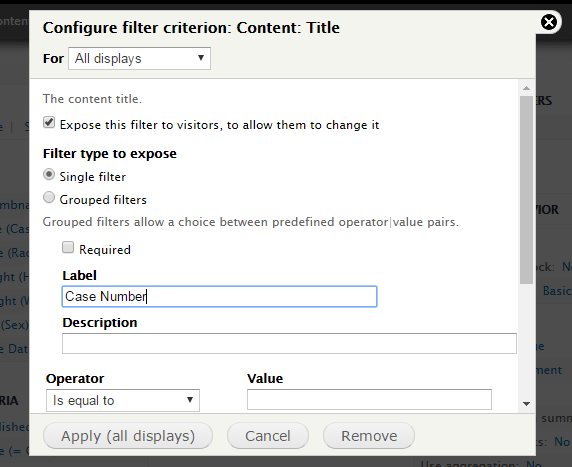

# How To

## Create a View

If you are not familiar with Views, it is basically a tool that will build a query for you, and then display the results in the format of your choice. [If you need more details about Views, you should check out the "What is Views?" page on drupal.org.](https://www.drupal.org/docs/7/modules/views/what-is-views) You can see the view display for the GBI's case list at http://gbi.georgia.gov/cases. We'll be building a table-style view like the one there.

Click on Structure from the main menu. On the Structure page, click on Views.

You will now see a list of current views. Click on _Add new view_.

On the next screen, you'll get some preliminary options for your brand new view. Fill in this form with the following values.

- **View name:** Cases
- Show Content of type _Case_ sorted by _Unsorted_
- **Display format:** Table

You could just save this view, but we want to configure it further, so select the _Continue & edit_ button at the bottom of this screen to add more options to your new view.

### Add and Configure a Contextual Filter

The first thing you should do is add a contextual filter for your case types. This will allow you to construct URLs that filter this view by case type, i.e. `cases/robberies`, without creating a whole separate view or view display per case type.

Click on Advanced and then "Add" next to Contextual Filters.

Search for "case type", check the box to select the field, and then click the _Apply (all displays)_ button to save your selection.

You'll be presented with a list of options for your case type contextual filter. In the fieldset "_When the filter value IS in the URL or a default is provided_":

- Check "Override title", and set the text field to `%1`
- Check "Override breadcrumb", and set the text field to `%1`
- Check "Specify validation criteria"
  * Validator: _- Basic validation -_
  * Action to take if filter value does not validate: _Display contents of "No results found"._

Choose the _Apply (all displays)_ button to save your selection.

### Add Fields and Sort Criteria

Next, choose the fields you'd like to show in your table. Click _Add_ next to "Fields", and then tick off the fields you want to include in your table. Make sure to include the Case Date. Then apply to all displays. 

You'll be presented with a screen to configure each field you've just added; if you don't want to change any options you can simply save each one. Once they are all configured, you can rearrange them to your liking.

Next add Sort Criteria. Case Date is a logical field to sort by, but you can also use any other field that makes sense for your organization, like Post Date or Title.

### Expose Some Filters

GBI's cases page has exposed filters for the title/case number and the sort order. Exposed filters allow site visitors to sift through your view to find the information they are looking for.

To allow site visitors to filter by title/case number, add a _Title_ filter.

When configuring the field, check the _Expose this filter to visitors, to allow them to change it_ checkbox. Change the label from "Title" to "Case Number", and apply it to all displays.

You can expose any of your filters or sort criteria to site visitors. When you're finished configuring your exposed filters, save your View. Visit the page at `/cases` to check out the layout. It may look something like this:

When your new view has been configured to your specifications, [it is time to export your new content type and view to a Feature.](03_create_feature.md)
