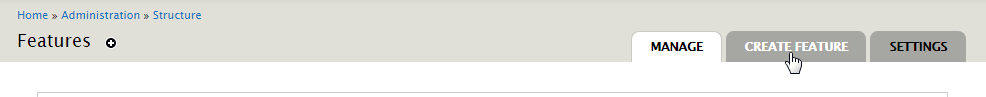
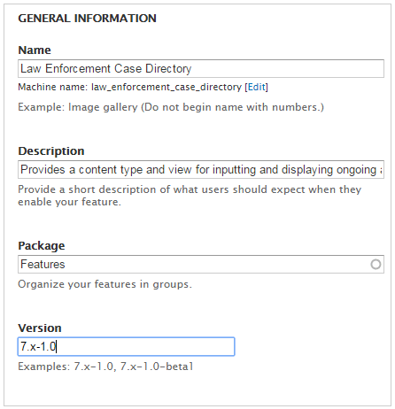
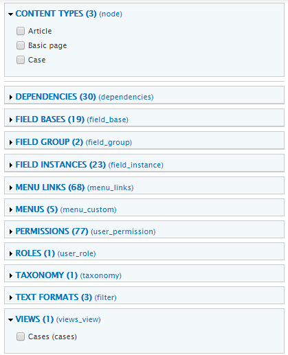
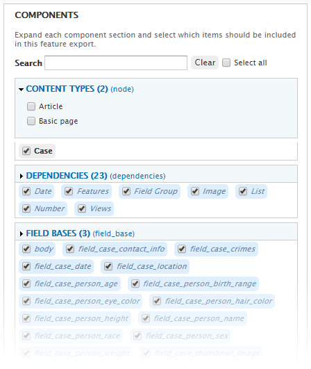
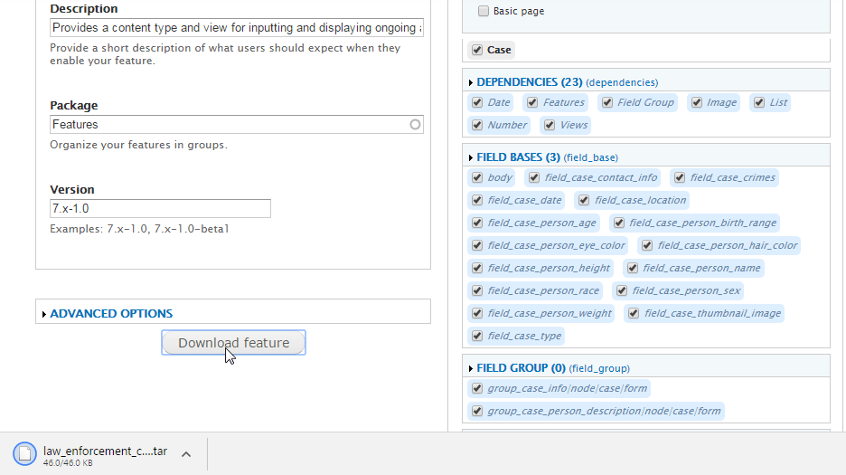

# How To

## Export the Configuration to a Feature

Why should you export your new content type and view to a Feature? A Feature is just a Drupal module built using Features. This means you can reuse it, just like any other module. You can build out your configuration on one site, and then move it to another. [If you're using some form of version control (and I recommend that you do)](https://www.drupal.org/node/803746), using Features with Drupal 7 allows you to capture and track your configuration changes in code.

To create your feature, go to Structure -> Features -> Create Feature.

### Name your Feature

- **Name:** Law Enforcement Case Directory (you can name yours whatever you like, Cases Directory, Unsolved Cases, Police Case List, etc)
- **Description:** Provides a content type and view for inputting and displaying ongoing and historic cases.
- **Package:** Features
- **Version:** 7.x-1.0

### Choose what to Export

1. Under Content Types, tick off "Case".
2. Under Views, tick off "Cases".

As you check off these items, you will see Features will also automatically add the items that should be exported with your complete configuration, like dependencies and field instances.

### Export and open

When you are ready to export, hit the "Download Feature" button. Features will create a \*.tar file with your new feature module and it will download to your computer.

If you’re not familiar with \*.tar files, know that they are a standard archive type of file in the Unix world. They'll automatically extract themselves on Mac. On Windows, you can use a utility program like Winzip or 7-zip to extract them as you would a \*.zip file.

Extract your files and [get ready to add some custom code to your new feature.](04_add_custom_code.md)
